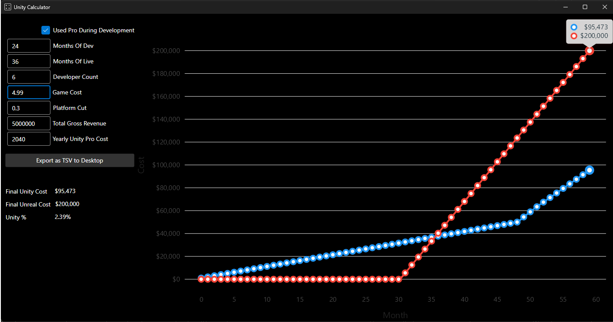

# Unity Calculator
Simple Avalonia app for estimating Unity vs Unreal costs.

Trying to figure out if Unity is right for you.  You can use this tool to see how much
it will cost you over the lifetime of your project and how it compares to Unreal.

# Running
If you have Visual Studio and .Net 7 installed, you only have to open UnityCalculator.sln and hit F5

# Comiling
If you have Visual Studio and .Net 7 installed you can run "Run - Publish NativeAOT.bat" and it 
will publish the app as a single file executable (approx. 40 MB) and copy to the root folder
"UnityCalculator.exe"

